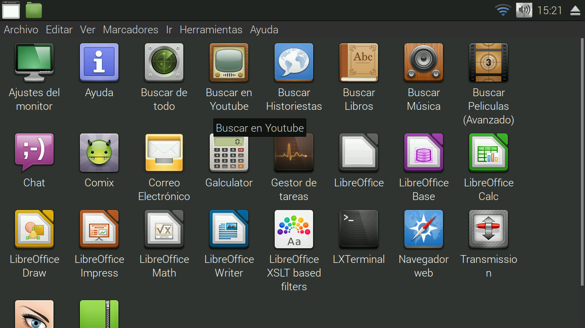

SmartTV en GNU (realmente inteligente)
======================================

Es un conjunto de aplacaciones para armar tu televisor realmente inteligente, o sea descarga y reproduce series, peliculas y musica de torrent.

Como usarlo
-----------

Novedades
---------

Aplicaciones
------------

Buscar videos
-------------

	
Busca peliculas en imdb y genera archivos `.desktop` en un carpeta al presionar sobre ellos se busca la pelicula en `torrent-search`.
Este se renueva cada X cantidad de tiempo.

Instalar en GNU
===============

~~~
wget -O - https://raw.githubusercontent.com/maquinas-libres/smartv/master/instalar.sh | bash
~~~

_**Nota:** necesita la clave de administración para instalar dependencias y archivos._

Correr
------

~~~
torrent-buscar-carpeta-genero
~~~

Esto genera los lanzadores de peliculas en `~/Vídeos/Películas`

Instalar en raspberry
=====================

Generar una microsd de raspberian y luego compiar las carpetas `home`, iniciar la raspberry y correr `~/instalar.sh`

Que tiene
=========

* **splash:** fbi 
* **iconos:** mate-icon-theme-faenza
* **tema:** [moka](http://gnome-look.org/content/download.php?content=168447&id=1&tan=71798382)
* **subtitulo:** [subdl](https://github.com/akexakex/subdl)
* **reproductor:** omxplayer, mpv, mplayer
* **streaming:** * peerflix	
* **descarga:** transmission o uget+aria2	→ grabar en videos una vez terminada la descarga
* **filesharing:** youtube-dl

extras
------

* **navegador:** epiphany
* **Clima:** conky
* **historietas:** comix
* **pdf:** evince
* **texto:** fbreader / navegador / evince
  * docx -> docx2txt  -> html
  * doc -> antiword -> markdown -> html
  * xls: ?
* **chat:** pidgin
* **correo:** geary
* **privacidad:** tor
* **Noticias:** rsstail

Juegos
------

* juntar por colores: gweld
* tableto: gtkboard, xmahjongg
* solitario: pysol (es medio feo)
* aventura simple (mario 1 o bubble)

Extructura
----------

* *-lt: listas de busquedas	(torrentz-lt, kickass-lt, dd-lt, imdb-lt, starpage-lt)
* *-dl: descarga	(youtube-dl)
* torrent-*: basado en torrent
* *-carpeta-*: genera carpetas	(video, youtube, serie, musica)
* desktop: lanzadores

Quehaceres
----------

* filtrar el año siempre
* foco para usar teclado, siempre en ventana arriba de todas
* listas mas faciles de maneras, unificar todo
* xbindkeys:
  * decargar
  * cambiar de zoom (dbus)
  * cambiar de subtitulos (script)
* generar series (esta por la mitad)
* normalizar el volumen
* musica esta mal como se generan los links
* generar cache wget y link
* poner en pausa al pidgin
* lector de noticias
* mascota

mirar esto:

* teclado: http://ozzmaker.com/virtual-keyboard-for-the-raspberry-pi/?utm_source=feedly o wish
* https://github.com/Ivshti/stremio-addons-client
* https://www.npmjs.com/package/multipass-torrent

--

**Bitcoin:** 19qkh5dNVxL58o5hh6hLsK64PwEtEXVHXs
