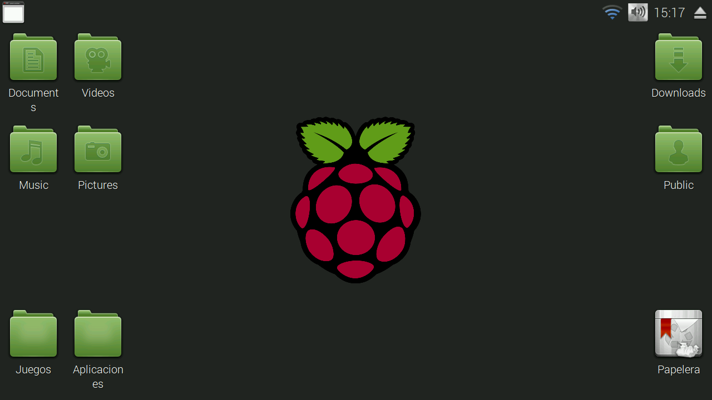
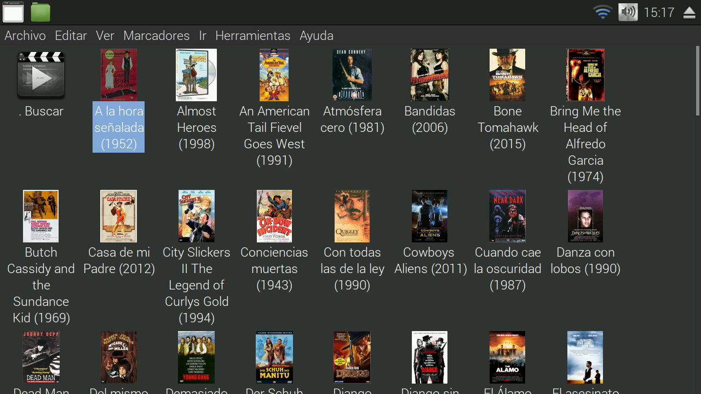

SmartTV en GNU (realmente inteligente)
======================================

Es un conjunto de aplacaciones para armar tu televisor realmente inteligente

Como usarlo
-----------

	

Novedades
---------

Busca peliculas en imdb y genera archivos `.desktop` en un carpeta al presionar sobre ellos se busca la pelicula en `torrent-search`.
Este se renueva cada X cantidad de tiempo.

-- 

Que tiene
=========

* **splash:** fbi 
* **iconos:** mate-icon-theme-faenza
* **tema:** [moka](http://gnome-look.org/content/download.php?content=168447&id=1&tan=71798382)

reproductor
-----------

* omxplayer
* mplayer

subtitulos
----------

* [subdl](https://github.com/akexakex/subdl)
	
buscador
--------

* torrent-search.sf.net	→ python-libxml2 python-httplib2

streaming
---------

* peerflix	

descarga
--------

* youtube-dl	→ omxplayer -b $(youtube-dl --max-quality 35 -g "$1")
* transmission	→ grabar en videos una vez terminada la descarga

mensajes
--------

* notify-send	→ se necesita una ventana interior
libnotify-bin

novedades
---------

* liferea
* conky | para el clima en pantalla

navegador
---------

* epiphany ?
* xxxterm ?
	
extras
------

###textos

* calibre?
* comix
* evince
* openoffice

###chat

* pidgin

###mail

* geasy

###privacidad

* tor

Quehaceres
----------

* tema oscuro para openbox
* ventana cuando descarga
* placa o imagen para cuando esta descargando

mirar esto:

* https://github.com/Ivshti/stremio-addons-client
* https://www.npmjs.com/package/multipass-torrent
