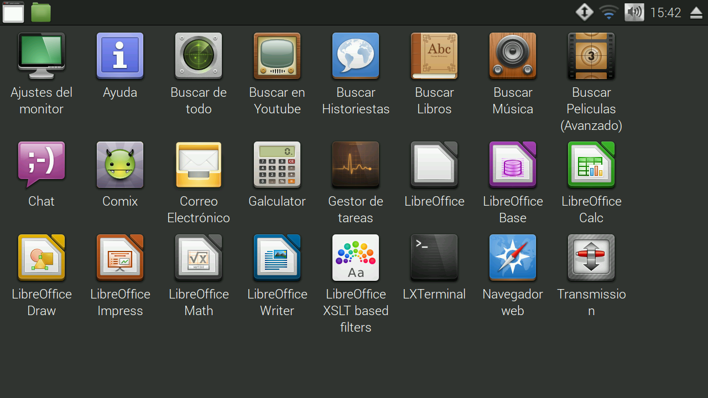

SmartTV en GNU (realmente inteligente)
======================================

Es un conjunto de aplicaciones para armar tu televisor realmente inteligente, o sea descarga y reproduce series, peliculas y musica de torrent.

Como usarlo
-----------

Aplicaciones
------------

Buscar videos y películas
-------------------------

Busca películas en **imdb** y genera archivos `.desktop` en un carpeta al presionar sobre ellos se busca la película en `torrent-search`.
Este se renueva cada X cantidad de tiempo.

Instalar en GNU
===============

~~~
wget -O - https://raw.githubusercontent.com/maquinas-libres/smartv/master/instalar.sh | bash
~~~

_**Nota:** necesita la clave de administración para instalar dependencias y archivos._

Correr
------

~~~
torrent-buscar-carpeta-genero
~~~

Esto genera los lanzadores de películas en `~/Vídeos/Películas`

Instalar en raspberry
=====================

Generar una microsd de raspberian y luego copiar las carpetas `home`, iniciar la raspberry y correr `~/instalar.sh`

Que tiene
=========

* **splash:** fbi 
* **iconos:** mate-icon-theme-faenza
* **tema:** [moka](http://gnome-look.org/content/download.php?content=168447&id=1&tan=71798382)
* **subtitulo:** [subdl](https://github.com/akexakex/subdl)
* **reproductor:** omxplayer o mpv
* **streaming:** * peerflix	
* **descarga:** transmission
* **filesharing:** youtube-dl

extras
------

* **navegador:** epiphany
* **historietas:** evince
* **pdf:** evince
* **texto:** evince
* **chat:** pidgin
* **correo:** geary
* **privacidad:** tor
* **Noticias:** rsstail
* **Clima:** conky

Quehaceres
----------

* filtrar el año siempre
* combinación de teclas:
  * descargar
  * cambiar de zoom (dbus)
  * cambiar de subtítulos (script) 
* generar series (esta por la mitad) 
* lector de noticias 
* probar buscar subtitulos con sublime

mirar esto:

* teclado: http://ozzmaker.com/virtual-keyboard-for-the-raspberry-pi/?utm_source=feedly o wish
* https://github.com/Ivshti/stremio-addons-client
* https://www.npmjs.com/package/multipass-torrent

--

**Bitcoin:** 19qkh5dNVxL58o5hh6hLsK64PwEtEXVHXs
